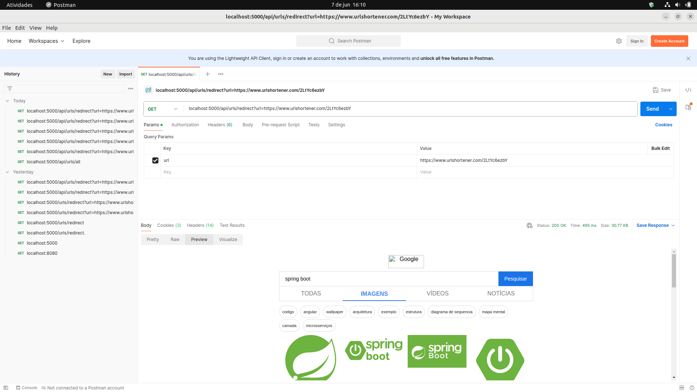
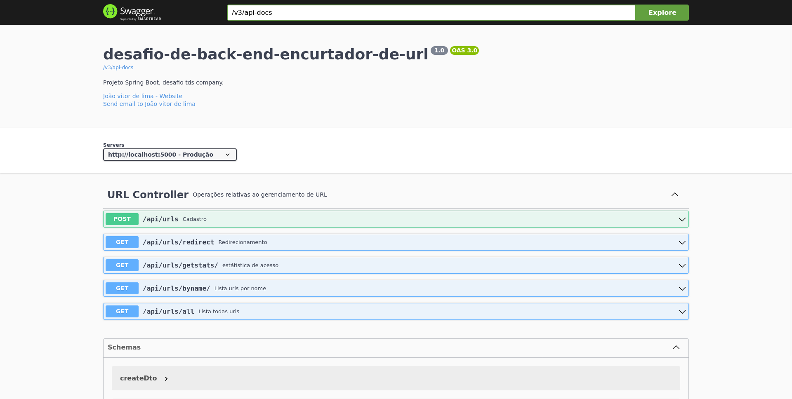

# Spring Security com JWT e Role based access control.

> Foto de redirect obtido via postman.

### Check

- [x] Cadastrar URL
- [x] Acessar URL encurtada
- [x] Visualizando estatísticas

## 💻 Pré-requisitos

Antes de começar, verifique se você atendeu aos seguintes requisitos:

- Maven para gerenciamento de pacotes
- Java 17.0 +
- docker-compose up --build

## ☕  Swagger disponível :

URL : http://localhost:5000/swagger-ui/index.html

## 🤝 Colaboradores

<table>
  <tr>
    <td align="center">
      <a href="https://www.linkedin.com/in/jo%C3%A3o-vitor-de-lima-74441b1b1/" title="Linkedin">
         
        
          <b>João lima</b>
        
      </a>
    </td>
  </tr>
</table>